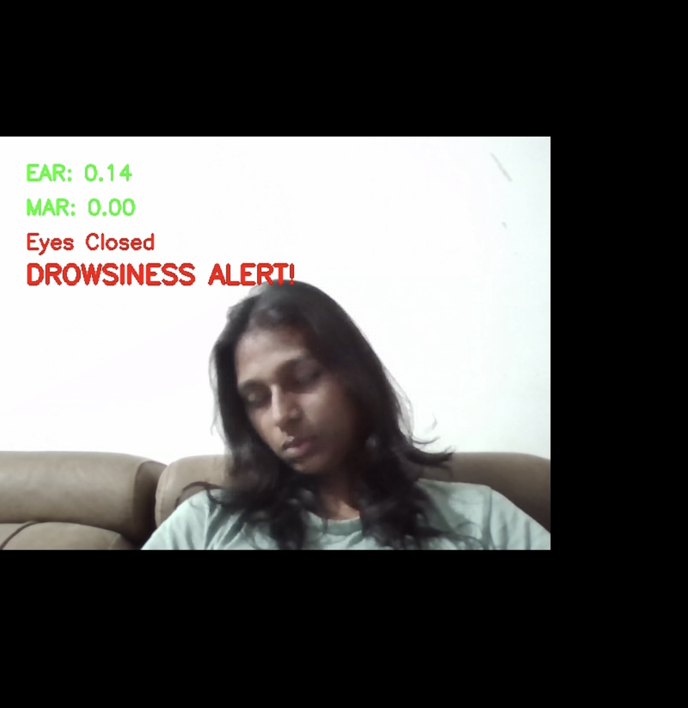
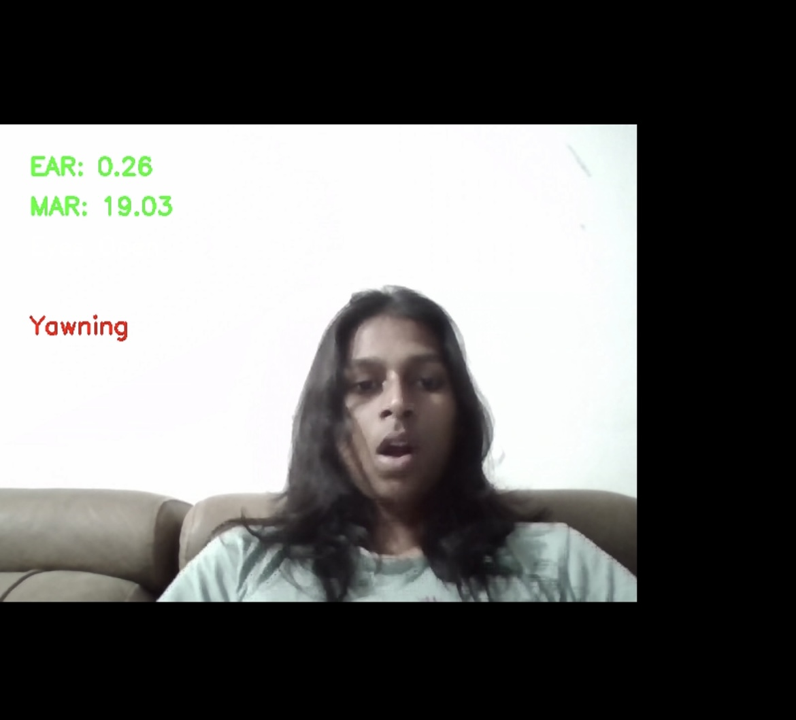

# DriveAlert 🚗💤

**Real-time Driver Drowsiness & Yawning Detection using MediaPipe, OpenCV, and Text-to-Speech.**  
DriveAlert monitors a driver’s eyes and mouth through a webcam feed to detect signs of sleepiness or fatigue and issues both on-screen and voice alerts.

---

## 📹 Demo

[](https://youtu.be/RvffPoNGilg)

## 📸 Screenshots

  


---

## 🛠 Tech Stack

- **Python:** Main programming language.  
- **OpenCV:** For video stream processing.  
- **MediaPipe:** For robust facial landmark detection.  
- **NumPy:** For efficient numerical computations.  
- **pyttsx3:** For text-to-speech alerts.

---
## 📁 Project Structure
DriveAlert/
│
├── main.py # Main script
├── demos/
│ ├── DriveAlert_DemoImage_1.PNG
│ ├── DriveAlert_DemoImage_2.PNG
│ └── DriveAlert_DemoVideo.mp4
├── README.md
└── requirements.txt # Python dependencies

yaml
Copy
Edit

---

## 📋 Features
- Real-time detection of **drowsiness** and **yawning**
- Works **offline** (no internet required)
- **Voice alerts** for better safety
- Easy to run on any **webcam-enabled device**

---

## ⚙️ How It Works

1. **Capture** — The webcam feed is read in real-time using OpenCV.
2. **Detect Landmarks** — MediaPipe detects facial landmarks (eyes, mouth).
3. **Calculate EAR & MAR** —  
   - EAR < threshold → eyes closed for a certain duration → drowsiness alert.  
   - MAR > threshold → mouth wide open for a certain duration → yawn alert.
4. **Alert** — Visual and voice alerts are triggered using pyttsx3.

---

## 🚀 Installation & Usage

```bash
# Clone the repository
git clone https://github.com/saichethana28/DriveAlert.git
cd DriveAlert

# Install dependencies
pip install opencv-python mediapipe numpy pyttsx3

# Run the program
python main.py

Press 'q' to quit the program.

📜 License
This project is licensed under the MIT License – see the LICENSE file for details.

📬 Contact
Created by V. Sai Chethana
📧 Email: saichethanavesireddy@gmail.com
